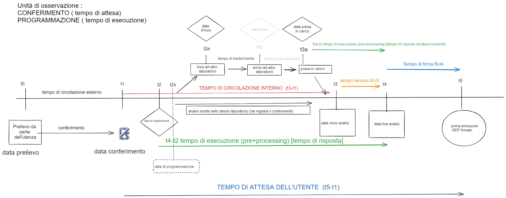

Di seguito uno schema che riassume le fasi del processo a cui sottostanno i campioni sottoposti ad analisi per le diverse motivazioni/finalità in tutto l'IZSLER:

 
```{r echo=FALSE, fig.align = "center",out.width = '90%', }

```

Ad ogni singolo conferimento sono associate i seguenti eventi/tempi:

**t0-data del prelievo**: è la data in cui il conferente effettua il prelievo del campione o campioni che consegnerà all'IZSLER per le successive analisi. L'Istituto non effettua il campionamento. 

**t1-data di conferimento** alle sezioni (sedi o periferia) del campione/campioni. 

**t1-t0** : tempo di circolazione esterno del campione. Questo intervallo di tempo non è dipendente dalle azioni dell'Istituto ma è comunque importante da tenere sottocontrollo in quanto rappresenta il tempo in cui il campione deve essere adeguatamente conservato ( pena la non idoneità del campione) ed è una misura della capacità organizzativa del conferente soprattutto quando si tratta dell'Autorità Sanitaria.  E' un intervallo di tempo che comunque influisce sulla percezione di "attesa" dell'utenza, dilatando il tempo di attesa dell'utenza.

A t1 il campione viene "accettato" previa verifica delle condizioni di idoenità da parte del personale dell'accettazione; ne viene misurata dove previsto la temperatura di conservazione/trasporto da parte del conferente e quindi stoccato a temperatura ambiente/refrigerato/congelato a seconda della natura del campione e degli esami richiesti, per il tempo necessario alle attività di registrazione/programmazione e quindi di analisi.

**t2- data di registrazione/programmazione del conferimento** :  è la data in cui il personale dell'accettazione IZSLER registra nel sistema Darwin le informazioni relative al conferimento ed effettua la programmazione degli esami che saranno eseguiti nei laboratori. Il sistema automaticamente assegna il numero di conferimento e la data di registrazione. In questa fase il personale dell'accettazione assegna allo stesso conferimento una o più finalità o motivi del prelievo. Ad ogni finalità è associata una o più prove. 

**t2x- data inserimento riga di programmazione**: questa data/ora registra il momento dell'inserimento della programmazione della prova. 


**t2-t1**: questo intervallo di tempo , in genere molto breve, è una misura dell'attività del personale di accettazione e del sistema di organizzazione in essere, contribuisce al più ampio tempo di circolazione interno del campione. In questo intervallo di tempo il conferimento dovrebbe essere conservato opportunamente in base alle sue caratteristiche. In questo intervallo di tempo il conferimento non è difatti ancora entrato nel sistema e l'unica modalità di corretto tracciamento è il documento di accompagnamento, comprende anche t2x

**t2-t2x**: questo intervallo di tempo registra misura tempo tra la data di registrazione del conferimento e la data d'inserimento delle stringhe di programmazione.


A questo punto del processo il conferimento in base alla/alle finalità e soprattutto agli esami programmati subisce differenti destini che comporta differenti tempistiche. Di seguito i differenti scenari:

1. Lo scenario più semplice prevede che gli esami vengano eseguiti nella stessa struttura accettante che risulta proprietaria del conferimento. Per ognuna delle  prove previste dalla programmazione viene registrata la data d'inzio (t3 nello schema) e di fine analisi (t4). 

2. E'sufficiente che una singola prova prevista nella programmazione   sia eseguita in un laboratorio differente dai laboratori presenti nella struttura accettante, che il conferimento assuma un carattere diverso e particolare ai fini del monitoraggio dei tempi del processo e in particolare per la definizione del tempo di attesa dell'utenza. 
In questo caso prima della registrazione del t3 sono previste altri due tempi: 
t2a - data d'invio del/dei campione/i  e t2b - data di presa in carico da parte del laboratorio che eseguirà l'analisi. Il sistema non prevede la registrazione della data di arrivo del campione alla struttura di destinazione, spesso arrivo e presa in carico coincidono ma non è sempre cosi. 


In entrambi gli scenari è possibile identificare il *tempo di circolazione interno* o *tempo organizzativo del conferimento* rappresentato dall'intervallo t3-t2, comprensivo anche del tempo **t2-t2x**
( risulta interessante anche monitorare il tempo tra l'inserimento della stringa di programmazione t2x e l'inizio analisi t3)

Teoricamente è atteso che il tempo di circolazione interno sia più breve nel caso dello scenario 1 rispetto allo scenario 2. In questo caso i differenti tempi sopra definiti permettono di studiare tre intervalli di tempo parziali: 

t2a-t2 : **tempo di allestimento/confezionamento** dei campioni destinati ad altri laboratori

t2b-t2a: **tempo di trasporto** del campione

t3-t2b:  **tempo di sosta del campione** tra la presa in carico e l'inizio delle analisi. 


Il **tempo di allestimento** è totalmente responsabilità della struttura accettante che quindi avrebbe  gli strumenti e le opportunità per gestire, controllare, migliorare questo tempo.

Il **tempo di trasporto** è dipendente dall'organizzazione dei mezzi interni dell'Istituto ma in parte è responsabilità sia di chi riceve il campione che del laboratorio che dovrà effettuare l'analisi in quanto comprende anche il tempo (non registrato) tra l'arrivo a destinazione e la presa in carico del campione.

Il **tempo di sosta del campione** è dipendente dal laboratorio che riceve dalla struttura periferica il campione da esaminare

<!-- l'ultimo tempo parziale è totalmente a carico della struttura che eseguirà la prova. -->


Esiste un terzo scenario che per dinamica è totalmente simile allo scenario dei conferimenti con prove per altri laboratori ma che presuppone una responsabilità differente della struttura inviante: è il caso dei conferimenti che vengono accettati spesso registrati ma a volte anche no, in un laboratorio ma le cui prove sono eseguite in un altro laboratorio a cui viene trasferità la proprietà del conferimento e quindi la responsablità dell'emissione del rapporto di prova. In questo caso il laboratorio inviante è responsabile, ai fini della definizione del tempo di utenza, del tempo che impiega a gestire il conferimento , a prepararlo e inviarlo al laboratorio di destinazione.


Infine ultimo tempo è rappresentato dalla data di emissione del primo rapporto di prova firmato (t5). Questo tempo rappresenta il primo feedback che l'utenza ottiene dal momento che ha consegnato i campioni al laboratorio IZSLER. 

<!-- Si fa riferimento qui solo ai conferimenti completi e non parziali, ai fini della definizione del tempo di attesa dell'utenza.  -->

L'intervallo di tempo(t5-t4), è calcolato utilizzando tra le prove previste dal conferimento quella che ha il maggior intervallo tra data inizio e data fine analisi. 


**Tempo di attesa dell'utenza**: sulla base del processo illustrato sopra , dei tempi che intervengono e definendo l'unità di osservazione il conferimento,  definiamo il tempo di attesa dell'utenza come il tempo che intercorre tra la data di consegna del/dei campioni a una qualsiasi accettazione IZSLER e la data di emissione del primo RDP firmato. 
Questa definizione corrisponde al tempo in giorni che realmente l'utente attende per la restituzione dei risultati di analisi per cui ha chiesto la prestazione dei laboratori IZSLER. 
E' possibile definire anche un TAUT più dilatato come tempo di attesa Percepito dall'utenza se nella definizione di cui sopra si considera anche il tempo di circolazione esterno (di cui l'Istituto non è responsabile e non ha in mano le leve per controllarlo, ma che può monitorarlo, analizzarlo e restituire all'utenza i risultati di tale analisi al fine di migliorere la programmazione dei proicessi di campionamento) e i giorni non lavorativi. A questo proposito è bene ricordare che l'importanza di alcuni esiti relativi a derrate deperibili va oltre la definizione "amministrativa" di un tempo di risposta che \strong{non includa} i giorni non lavorativi.


<!-- # Analisi dei diversi tempi di processo nelle diverse strutture IZSLER ( anno 2022) -->

<!-- In base al processo sopra descritto i conferimenti possono essere classificati in diverse categorie a seconda delle finalità e dell'esecuzioni in differenti laboratori delle prove. -->

<!-- Ai fini dell'analisi i conferimenti saranno distinti in queste categorie: -->

<!-- - Conferimenti con finalità singola -->
<!--   - Conferimenti con prove per altri laboratori -->
<!--   - Conferimenti con prove interne ( no altri laboratori) -->

<!-- - Conferimenti con finalità multiple -->
<!--   - Conferimenti con prove per altri laboratori -->
<!--   - Conferimenti con prove interne ( no altri laboratori) -->

<!-- Le analisi dei tempi di processo  saranno quindi eseguite per ogni categoria, in modo da rendere omogenei gli eventuali confronti tra strutture. -->


 


 